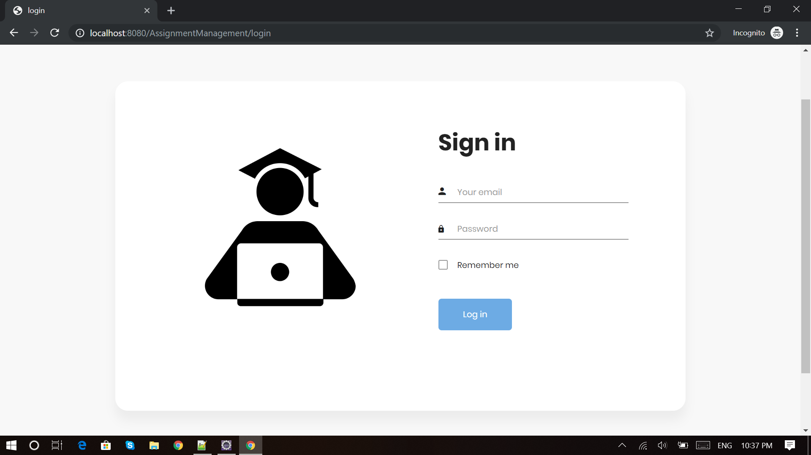
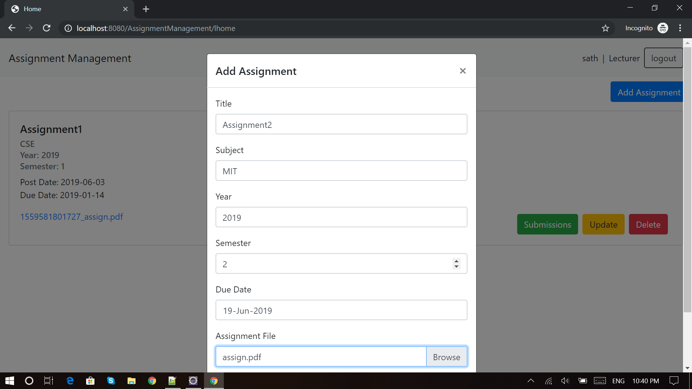
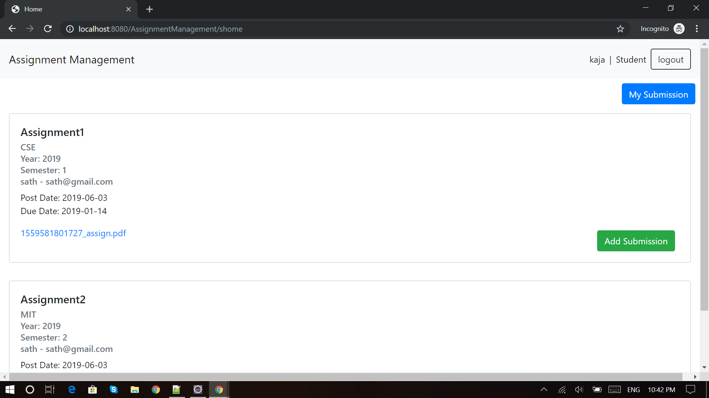
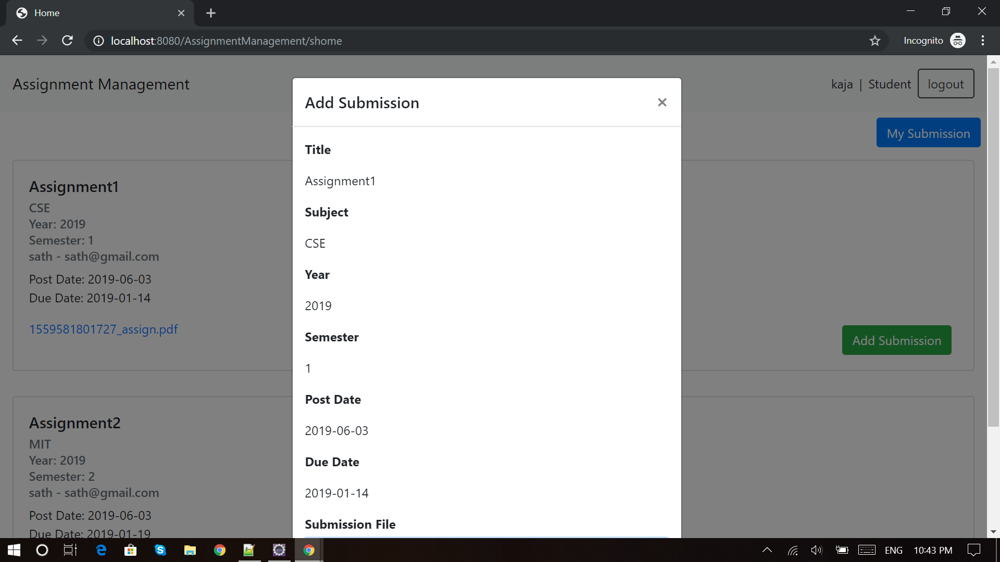
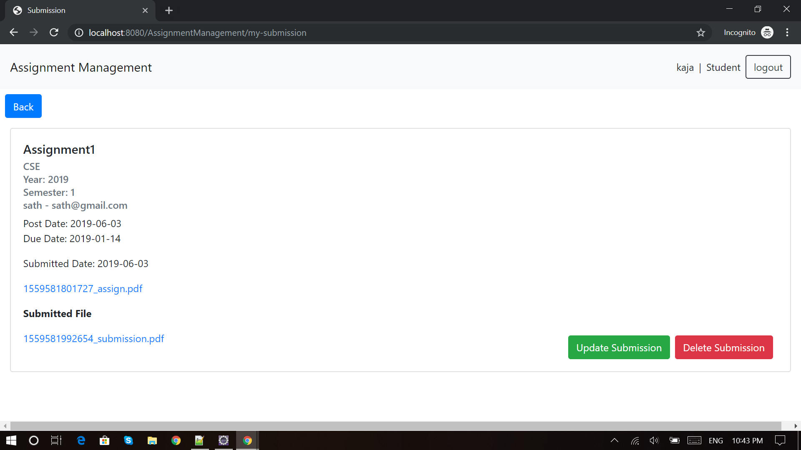
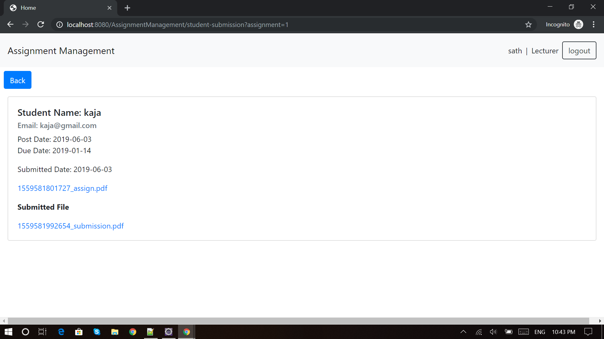
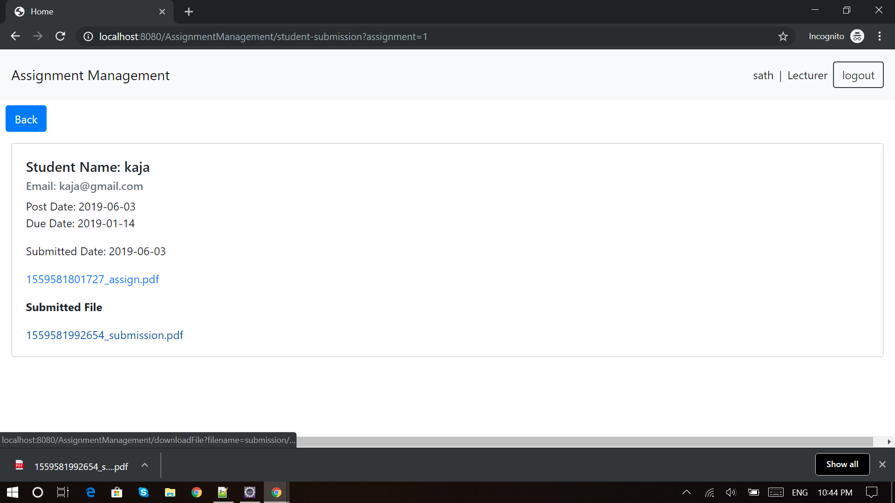

# ASSIGNMENT MANAGEMENT

```
Develop the web application for managed assignments and submissions of University using JAVA Servlet & JSP.
```

## Method

> First, clone or download the source code from github

> Then, import the `assignment_db.sql` script to MySQL 

> Then, go to the `DBConnection.java`, change your connection string

```
private String url = "jdbc:mysql://localhost:3306/assignment_db";
private String username = "root";
private String password = "";
```

> Then, change your `UPLOAD_DIRECTORY` Folder

```
private final String UPLOAD_DIRECTORY =  "<UPLOAD_DIRECTORY>" + "submission";

```

```
private final String UPLOAD_DIRECTORY =  "<UPLOAD_DIRECTORY>" + "assignment";

```

```
String filePath = "<UPLOAD_DIRECTORY>" + request.getParameter("filename");

```

> Finally, run the application on `Apache Tomcat Server` :+1:.

## Screenshots













